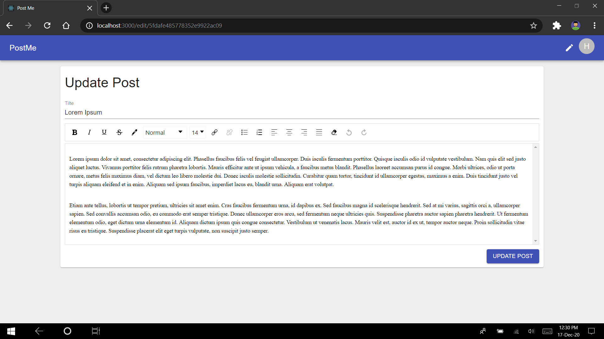

# Post Me Documnetation

## Starting With Docker

1. In Backend Folder Copy .env_sample to .env. (`copy .env_sample .env`). If you want you can edit this file according your need.

2. On The Current Folder open up a Terminal.

3. Use Command `docker-compose build` (This command needs to be used one time).

4. After the Build is complete use command `docker-compose up` (This needs to be executed whenever you want to start the server).

5. Once the containers are up. Visit `https://localhost:3000`.

## Starting Without Docker

### Requirements

1. MongoDB

2. NodeJS (with npm)

### Steps

1. Copy .env_sample to .env. (`copy .env_sample .env`).

2. After Copy, Edit the .env file specifically varibale DB_URL according to your needs.

3. Change Directory to backend `cd backend`.

4. Install packages `npm install`.

5. Start Backend Server `npm start`.

6. For Frontend open new terminal.

7. Change Directory to frontend `cd frontend`.

8. Install packages `npm install`.

9. Start Frontend Server `npm start`.

10. Visit `https://localhost:3000/`.

## Screenshots

1. Login Screen.

   

2. User Sign Up.

   

3. Home Page.

   

4. View Post.

   

5. View Post with user as the writer. (Edit and Delete Options are available.)

   

6. View Post with Another User.

   

7. Comments. (User who have posted the comment can only view Edit and Delete Buttons)

   

8. Reply Comments.

   

9. Edit Comment.

   

10. Create Post.

    

11. Edit Post.

    
